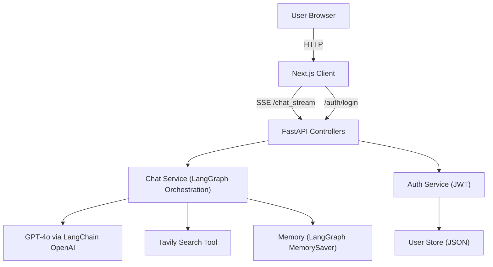
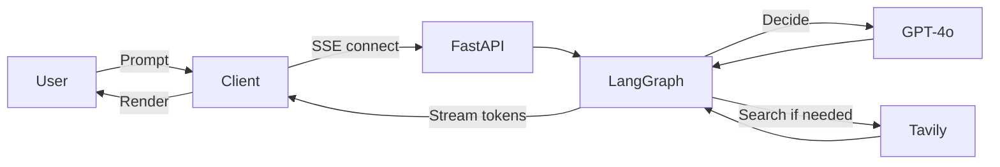
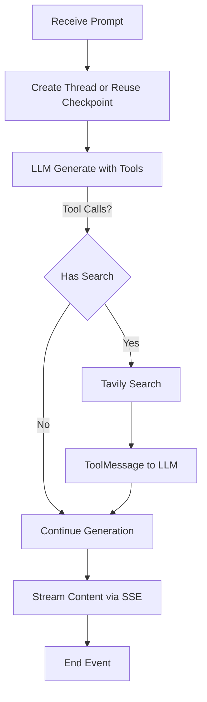
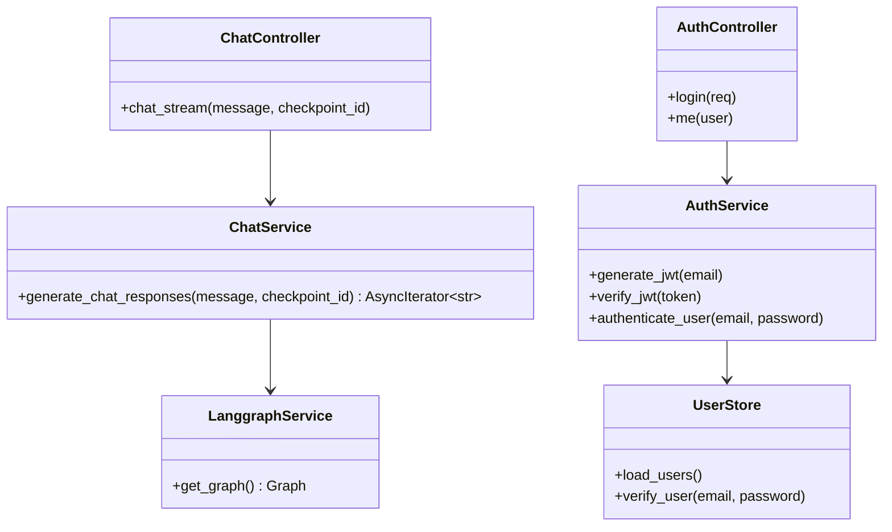
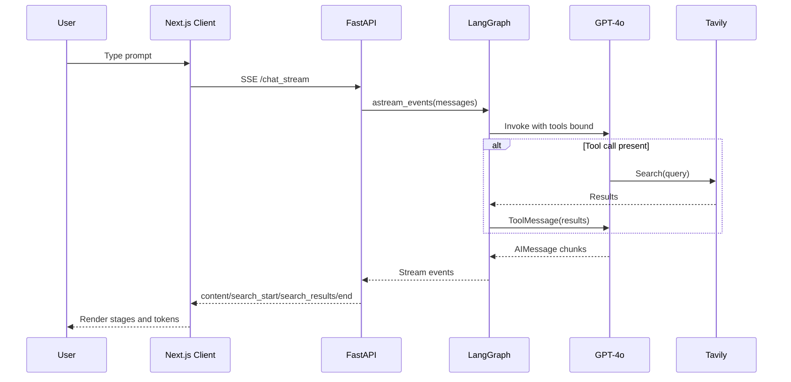
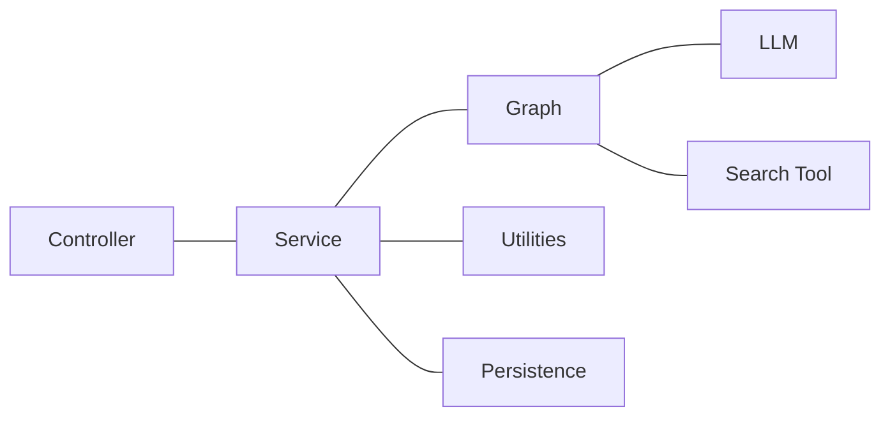
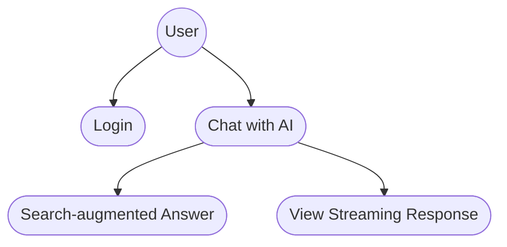
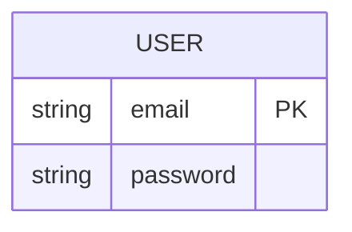

## Abstract

     Data Science AI Assistant is a modern, web-augmented conversational system that delivers trustworthy, up-to-date answers through an elegant, responsive interface. The application combines a Next.js client for an interactive chat experience with a FastAPI backend orchestrating OpenAI’s GPT-4o via LangGraph and the Tavily search tool. User queries are processed through an event-driven pipeline that can invoke targeted web searches when the model determines external context is needed. The system streams partial responses using Server-Sent Events (SSE), visualizes the search process stages—searching, reading, writing—and maintains conversational memory across turns. Authentication is implemented with lightweight JSON Web Tokens (JWT) and a simple JSON-backed user store for development. The overall architecture follows a clean MVC organization with well-separated concerns across controllers, services, models, persistence, and utilities, simplifying maintenance and future enhancements.
     
     This report documents the full lifecycle of the project, including requirements, feasibility, architecture, and design, with structured artifacts such as DFDs, UML diagrams, and an ER diagram. It presents selected code excerpts, testing strategies, and representative output screens to illustrate the user journey. The work concludes with an assessment of results and outlines enhancements such as protected streaming, production-grade identity, observability, and Retrieval-Augmented Generation (RAG) with persistent vector storage. The goal is a robust foundation for a high-quality, extensible AI assistant that combines strong UX with reliable, transparent reasoning grounded in current information.

## Table of Contents

- Abstract
- 1 Introduction
  - 1.1 Project Overview
  - 1.2 Purpose
  - 1.3 Existing System and Disadvantages
  - 1.4 Proposed System and Advantages
- 2 System Analysis
  - 2.1 Study of the System
  - 2.2 System Architecture
- 3 Feasibility Study
  - 3.1 Technical Feasibility
  - 3.2 Operational Feasibility
  - 3.3 Economic Feasibility
- 4 Software Requirement Specification
  - 4.1 Functional Requirements
  - 4.2 Performance Requirements
  - 4.3 Hardware Requirements
  - 4.4 Software Requirements and Technology Introduction
    - 4.4.1 Technology Overview
    - 4.4.2 External Services and Configuration
- 5 System Design
  - Introduction
  - Data Flow Diagrams
  - UML Diagrams
    - Class Diagram
    - Sequence Diagram
    - Collaboration Diagram
    - Use Case Diagram
  - ER Diagram
  - Data Dictionary
- 6 Coding
- 7 Testing
  - 7.1 Introduction
  - 7.2 Testing Strategies
- 8 Output Screens
- 9 Conclusions
- 10 Further Enhancements
- References Bibliography

## 1 Introduction

### 1.1 Project Overview

     Data Science AI Assistant is a Perplexity-style chat application that couples large language model reasoning with selective web search. The Next.js client renders an accessible interface with live streaming, while the FastAPI server coordinates GPT-4o via LangGraph and Tavily to retrieve and synthesize current information. Clear MVC boundaries improve testability and evolution.

### 1.2 Purpose

     The system aims to provide accurate, transparent, and timely answers with a focus on UX. It streams responses for responsiveness, exposes search stages for trust, and retains context across turns to support multi-step problem solving in data science and adjacent domains.

### 1.3 Existing System and Disadvantages

     Traditional LLM chat UIs often produce outdated or unverifiable answers, lack visibility into retrieval steps, and block the user until full responses are generated. Many implementations tightly couple UI and model logic, hindering extensibility, or use opaque retrieval strategies that reduce user trust.

### 1.4 Proposed System and Advantages

     This system adds web-augmented retrieval using Tavily, streams partial tokens via SSE, surfaces search stages to the user, and isolates responsibilities across models, controllers, and services. Advantages include improved answer freshness, better responsiveness, greater transparency, and a maintainable, testable codebase.

## 2 System Analysis

### 2.1 Study of the System

     Actors include end users, the client application, and the backend services. Core modules comprise authentication, chat orchestration, retrieval tools, and streaming. The chat pipeline accepts user prompts, evaluates whether to search, executes searches if needed, and streams synthesized responses while preserving conversational memory across turns.

### 2.2 System Architecture

     The architecture follows client-server separation with MVC on the server and component-driven UI on the client. The server uses LangGraph to model conversation state, GPT-4o for reasoning, and Tavily for web results. SSE connects server results to the client UI incrementally.



## 3 Feasibility Study

### 3.1 Technical Feasibility

     The stack leverages mature, well-documented technologies. Next.js handles SSR and client interactivity; FastAPI delivers high-performance async APIs; LangGraph models conversation flows; Tavily provides a clean search tool; SSE is widely supported. The solution is technically straightforward to deploy on commodity infrastructure.

### 3.2 Operational Feasibility

     User onboarding is minimal and familiar. Operational tasks involve environment variable management, rotation of API keys, monitoring, and routine dependency updates. The MVC separation simplifies triage and reduces regression risk when iterating.

### 3.3 Economic Feasibility

     Costs include OpenAI usage, Tavily search quotas, and hosting. The architecture supports incremental scale, with clear levers to control spend (rate limiting, caching, search throttling). Development and maintenance costs are reduced via a clean architecture and automation.

## 4 Software Requirement Specification

### 4.1 Functional Requirements

     FR1 User authentication through email and password  
     FR2 JWT issuance on successful login  
     FR3 Authorized access to the chat interface  
     FR4 Submit prompts and receive streamed responses  
     FR5 Automatic invocation of web search when needed  
     FR6 Visualization of search stages searching, reading, and writing  
     FR7 Conversation memory maintained across turns  
     FR8 Basic error messaging for network and parsing issues  
     FR9 CORS-compliant API responses for client integration

### 4.2 Performance Requirements

     P1 Initial token latency under two seconds in typical conditions  
     P2 Streaming cadence under 150 ms between chunks when available  
     P3 End-to-end prompt-to-final completion under 10 seconds for non-search requests and under 15 seconds for search-augmented requests  
     P4 API uptime target 99.9 percent for production deployments

### 4.3 Hardware Requirements

     Minimum single vCPU and 1–2 GB RAM for development servers  
     Recommended 2–4 vCPU and 4–8 GB RAM for small production workloads  
     CDN fronting the client and regional API deployments as traffic grows

### 4.4 Software Requirements and Technology Introduction

### 4.4.1 Technology Overview

     Client Next.js, React, Tailwind CSS  
     Server FastAPI, Python 3.10+  
     Orchestration LangGraph, LangChain OpenAI  
     Model OpenAI GPT-4o  
     Retrieval Tavily Search Results tool  
     Transport Server-Sent Events for streaming  
     Security JWT-based auth with HMAC HS256

### 4.4.2 External Services and Configuration

     Environment variables OPENAI_API_KEY, TAVILY_API_KEY, optional JWT_SECRET, optional USERS_FILE. Local development uses a JSON user store; production should use a real identity provider and database.

## 5 System Design

### Introduction

     Design goals include modularity, testability, responsiveness, transparency of retrieval, and safe error handling. The system is structured to support future RAG and richer identity without core rewrites.

### Data Flow Diagrams

- Level 0



- Level 1 Chat Processing



### UML Diagrams

- Class Diagram



- Sequence Diagram Chat Flow



- Collaboration Diagram



- Use Case Diagram



### ER Diagram



### Data Dictionary

- USER
  - email string, primary identifier, unique, required
  - password string, plaintext for development only, required

## 6 Coding

     The codebase follows an MVC layout with `controllers`, `services`, `models`, `persistence`, and `utils` on the server, and a component-based Next.js client.

- Directory overview

```text
server/
  controllers/ auth_controller.py, chat_controller.py
  services/ auth_service.py, chat_service.py, langgraph_service.py
  models/ auth_models.py
  persistence/ user_store.py, users.json
  utils/ serialization.py
client/
  src/app/ page.tsx, login/page.tsx, layout.tsx
  src/components/ Header.tsx, MessageArea.tsx, InputBar.tsx
```

- Selected examples

```python
# server/controllers/chat_controller.py
from typing import Optional
from fastapi import APIRouter, Query
from fastapi.responses import StreamingResponse
from services.chat_service import generate_chat_responses

router = APIRouter()

@router.get("/chat_stream/{message}")
async def chat_stream(message: str, checkpoint_id: Optional[str] = Query(None)):
    return StreamingResponse(
        generate_chat_responses(message, checkpoint_id),
        media_type="text/event-stream",
    )
```

```python
# server/services/langgraph_service.py
from langchain_community.tools.tavily_search import TavilySearchResults
from langchain_openai import ChatOpenAI
from langgraph.checkpoint.memory import MemorySaver
from langgraph.graph import END, StateGraph, add_messages

SEARCH_TOOL_NAME = "tavily_search_results_json"

memory = MemorySaver()
search_tool = TavilySearchResults(max_results=4)
llm = ChatOpenAI(model="gpt-4o")
llm_with_tools = llm.bind_tools(tools=[search_tool])
```

```typescript
// client/src/app/page.tsx
const eventSource = new EventSource(url)
let streamedContent = ""

eventSource.onmessage = (event) => {
  const data = JSON.parse(event.data)
  if (data.type === 'content') {
    streamedContent += data.content
    // update message state with streamedContent
  } else if (data.type === 'search_start') {
    // update search stages with data.query
  } else if (data.type === 'search_results') {
    // update stage to reading and show URLs
  } else if (data.type === 'end') {
    eventSource.close()
  }
}
```

## 7 Testing

### 7.1 Introduction

     Testing validates correctness, resilience, and UX quality. The scope covers unit tests for services and utilities, integration tests for endpoints and streaming, and UI verification for rendering and error states.

### 7.2 Testing Strategies

     Unit tests validate JWT signing and verification, user lookup, and serialization helpers. Integration tests cover `/auth/login` flows and the `/chat_stream` SSE lifecycle including `checkpoint`, `content`, `search_start`, `search_results`, and `end` events. UI checks ensure token guard redirects, live rendering of streaming tokens, and stage visualizations. Non-functional tests include latency sampling and CORS validation.

## 8 Output Screens

     Login screen shows email and password fields, with error messaging for invalid credentials, and on success navigates to the chat page. The chat interface presents a header with logout, a scrollable message area, and an input bar. During answers, the assistant bubble streams tokens while the search stage indicator transitions through searching, reading, and writing. Representative screenshots to be inserted  
     • Login screen after invalid attempt  
     • Chat screen initial state with greeting  
     • Mid-answer stream showing searching and reading stages  
     • Completed answer with writing stage concluded

## 9 Conclusions

     The project delivers a performant, transparent, and extensible AI assistant that balances UX with trustworthy retrieval. Clean separation of concerns and streaming design provide a responsive experience while enabling continuous improvement. The foundation is suitable for production hardening and capability growth.

## 10 Further Enhancements

     Enforce auth on the chat stream with JWT and token propagation compatible with SSE  
     Replace JSON user store with a database and integrate a managed identity provider  
     Add RAG with vector storage, source attribution, and citation snippets  
     Implement observability, tracing, and structured logging  
     Introduce caching and rate limiting to control latency and spend  
     Harden CORS, secrets management, and error surfaces for production  
     Add CI/CD, test automation, and performance budgets

## References Bibliography

     FastAPI. FastAPI Documentation. `https://fastapi.tiangolo.com`  
     LangChain. LangChain Documentation. `https://python.langchain.com`  
     LangGraph. LangGraph Documentation. `https://github.com/langchain-ai/langgraph`  
     MDN Web Docs. Server-Sent Events. `https://developer.mozilla.org/docs/Web/API/Server-sent_events`  
     Next.js. Next.js Documentation. `https://nextjs.org/docs`  
     OpenAI. OpenAI API Reference. `https://platform.openai.com/docs`  
     Tavily. Tavily Search API Documentation. `https://docs.tavily.com`
